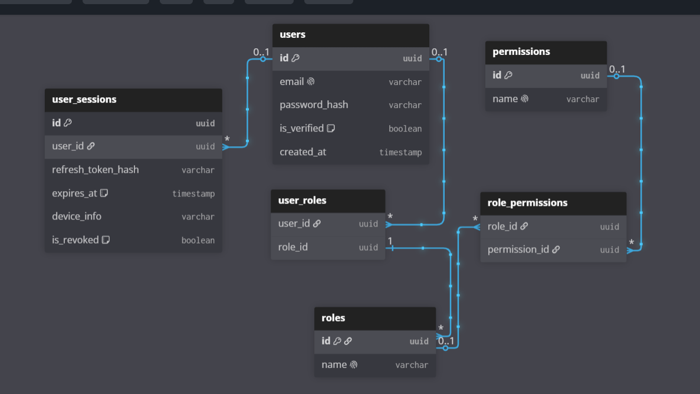
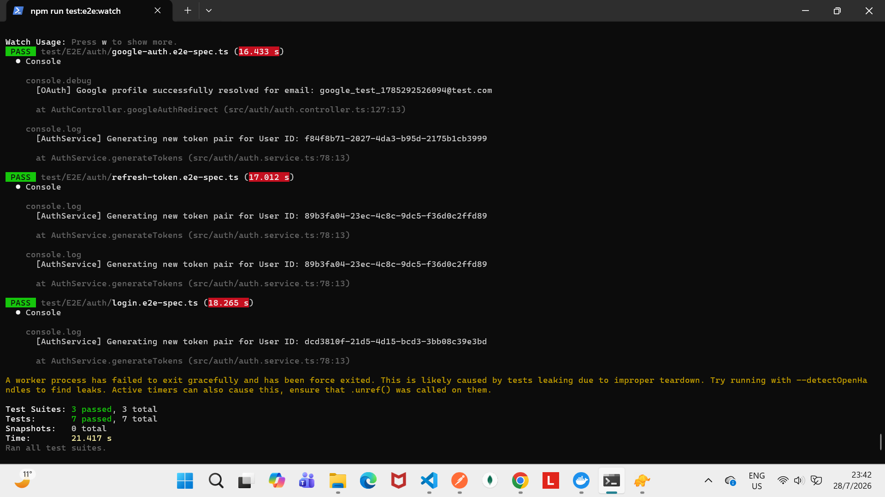

<p align="center">
  <a href="http://nestjs.com/" target="blank"></a>
</p>

# 🚀 Enterprise Auth Backend (NestJS & PostgreSQL)

A robust, scalable, and production-ready authentication system built with **NestJS**, **TypeORM**, **PostgreSQL**, and **Passport**. Designed following industry standards to guarantee secure session management, Role-Based Access Control (RBAC), and hybrid authentication strategies (Credentials and OAuth2).

---

## 🛠️ Tech Stack

- **Framework:** [NestJS](https://nestjs.com/) (TypeScript)
- **Database:** PostgreSQL
- **ORM:** TypeORM
- **Authentication:** Passport.js (JWT & Google OAuth 2.0)
- **Validation:** `class-validator` & `class-transformer`
- **Testing:** Jest & Supertest (E2E)

---

## 🏛️ Architecture & Database Model

The system was initially designed by modeling a robust relational schema to support session traceability, strict security, and granular permission handling:

- **`users`**: Stores core credentials (`uuid`, unique email, `password_hash`, `is_verified` status, and timestamps).
- **`user_sessions`**: Designed for active session control, registering refresh token hashes, device metadata, expiration, and revocation (Blacklist).
- **RBAC (`roles`, `permissions`, `user_roles`, `role_permissions`)**: A relational structure focused on flexible access control via specific roles and permissions.

<p align="center">
  
</p>

<p align="center">
  
</p>

---

## 🔌 Main Endpoints (REST API)

| Method   | Endpoint                    | Description                                                    | Status / Auth   |
| :------- | :-------------------------- | :------------------------------------------------------------- | :-------------- |
| **POST** | `/api/auth/register`        | Register a new user with password hashing.                     | Public          |
| **POST** | `/api/auth/login`           | Classic authentication (issues Access and Refresh Tokens).     | Public          |
| **GET**  | `/api/auth/google`          | Redirects to the Google OAuth2 authentication flow.            | Public          |
| **GET**  | `/api/auth/google/callback` | Google callback (Smart auto-registration if the user is new).  | Public          |
| **POST** | `/api/auth/verify`          | Processes the token to verify the user's email address.        | Public          |
| **POST** | `/api/auth/refresh`         | Renews the Access Token using the Refresh Token.               | Public          |
| **POST** | `/api/auth/logout`          | Revokes the session and invalidates the token in the database. | Protected (JWT) |

---

## ⚙️ Installation & Local Setup

### Prerequisites

- Node.js (v18+ recommended)
- PostgreSQL running locally or via Docker.

### 1. Clone the repository

```bash
git clone [https://github.com/Emiliano-Merelez-dev/Auth-Api.git](https://github.com/Emiliano-Merelez-dev/Auth-Api.git)
cd Auth-Api

```

### 2. Install dependencies (npm)

```bash
  npm install
```

### 3. Configure environment variables

```
PORT=3000
DB_HOST=
DB_PORT=
DB_USERNAME=
DB_PASSWORD=
DB_NAME=
JWT_SECRET=
GOOGLE_CLIENT_ID=
GOOGLE_CLIENT_SECRET=
```

### 4 Run the application

```
# Development
npm run start:dev

# Production
npm run build
npm run start:prod
```

🧪 Automated Testing (E2E)
The project features a robust End-to-End testing suite built with Supertest, simulating real registration, login, and token-refresh flows, alongside advanced guard mocking to avoid internet dependencies (such as the Google OAuth flow).

```
# run e2e test
npm run test:e2e

```
